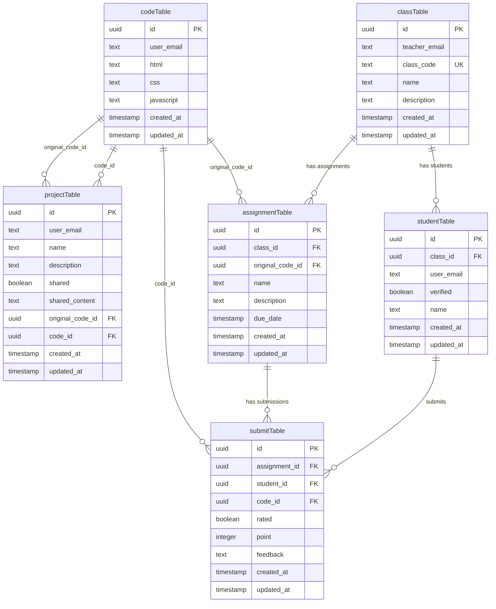

# PWCode

Hệ thống quản lý bài tập lập trình cho lớp học trực tuyến.

## Tính năng

- **Giáo viên**: Tạo lớp học, tạo bài tập, chấm điểm bài nộp
- **Học sinh**: Tham gia lớp học bằng mã lớp, nộp bài tập lập trình (HTML/CSS/JS)
- **Trình soạn thảo code**: Tích hợp Monaco Editor với preview trực tiếp
- **AI Review**: Hỗ trợ review code bằng AI (Mistral, Gemini, XAI)
- **Xác thực**: Đăng nhập bằng Google OAuth

## Tech Stack

- **Frontend**: Next.js 15 (App Router), React 19, TypeScript
- **Backend**: Next.js Server Actions, API Routes (Edge Runtime)
- **Database**: PostgreSQL (Neon), Drizzle ORM
- **UI**: shadcn/ui, TailwindCSS, Radix UI
- **Auth**: NextAuth v5 (Google OAuth)
- **AI**: Vercel AI SDK với Mistral, Google Gemini, XAI

## Cài đặt

### Yêu cầu

- Node.js 18+
- pnpm (hoặc npm/node)
- Tài khoản Neon PostgreSQL
- Google OAuth credentials
- API keys cho AI providers

### Cấu hình môi trường

Tạo file `.env.local`:

```env
DATABASE_URL=<neon-postgresql-connection-string>
AUTH_SECRET=<random-string>
AUTH_GOOGLE_ID=<google-oauth-client-id>
AUTH_GOOGLE_SECRET=<google-oauth-client-secret>
MISTRAL_API_KEY=<mistral-api-key>
```

### Cài đặt dependencies

```sh
# Cài đặt pnpm nếu chưa có
npm install -g pnpm

# Cài đặt dependencies
pnpm install

# Push database schema
pnpm push

# Seed dữ liệu test (tùy chọn)
pnpm seed

# Chạy development server
pnpm dev

# Build production
pnpm build
```

## Scripts

| Command | Mô tả |
|---------|-------|
| `pnpm dev` | Khởi động development server (Turbopack) |
| `pnpm build` | Build production |
| `pnpm start` | Chạy production server |
| `pnpm lint` | Kiểm tra ESLint |
| `pnpm push` | Push database schema lên Neon |
| `pnpm seed` | Seed dữ liệu test |

## Cấu trúc thư mục

```
├── app/                    # Next.js App Router
│   ├── (f)/               # Route group cho authenticated pages
│   │   ├── classes/       # Quản lý lớp học
│   │   ├── projects/      # Quản lý dự án code
│   │   ├── assign/        # Tạo/kết nối assignment
│   │   └── submit/        # Nộp bài tập
│   └── api/               # API routes (AI, auth)
├── components/            # React components
│   └── ui/               # shadcn/ui components
├── db/                   # Database
│   ├── schema.ts         # Drizzle schema
│   ├── drizzle.ts        # Database connection
│   └── seed.ts           # Seed data
├── lib/                  # Utilities
│   └── action/           # Server actions
└── contants/             # Constants (lưu ý: intentional typo)
```

## Database Schema



## License

Private project